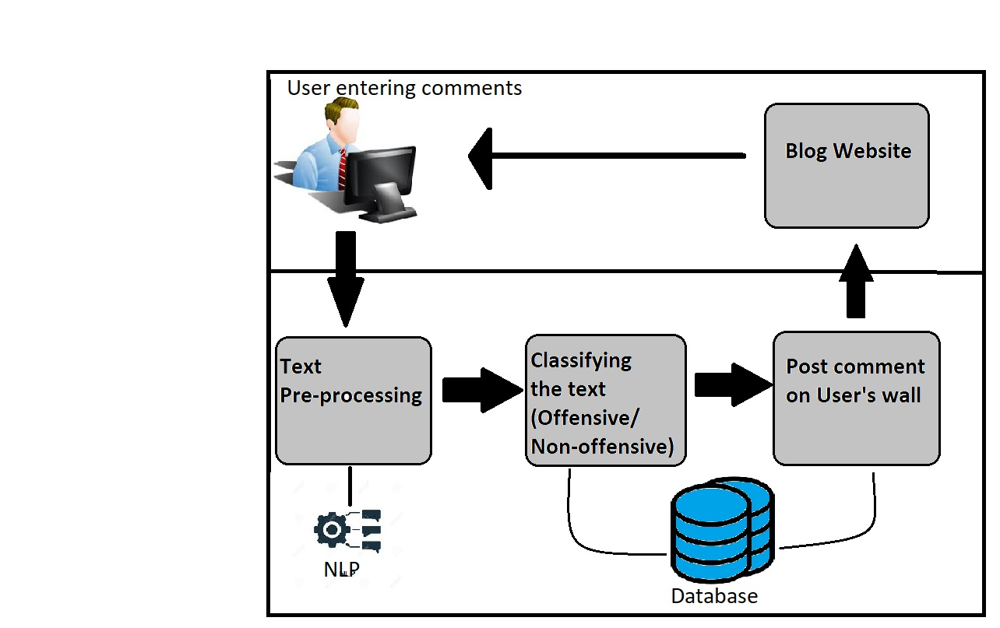

# Profane-comments-classification-using-SVM

This widespread growth of social media has led us to very serious issue and that is, users especially kids and teenagers are spending their most of the time on various social networking sites to connect with others, to share information, and to pursue common interests. In 2011, it was found by that 70% of teens use social media sites on a daily basis and nearly one in four teens hit their favourite social-media sites 10 or more times a day. While most of the teenagers benefit from their use of social media by interacting with and learning from others, they are also at the risk of being exposed to large amounts of offensive or vulgar online contents. ScanSafe's monthly "Global Threat Report" concluded that up to 85% of the major blogging sites contained offensive contents and 78% of them also included porn in the format of image, video, or offensive languages.

In addition to that,netizens are also facing the problem of cyber-bullying that occurs through offensive messages that are widely posted on social media. One study based on social media found that 24% of teens report that someone has written or posted mean or embarrassing things about them on social networking sites. As teenagers are more likely to be negatively affected by biased and harmful contents than adults, detecting online offensive contents to protect teenager’s online safety becomes an urgent need. So, to control such type of activity and prevent the unwanted messages which are written on user wall we can implement a Machine learning algorithm that can refine the texts and classify them as offensive or non-offensive contents.

In the above figure, there is a blog website which acts as content producer. The user inputs his comments which then gets stored into the database of the site. Meanwhile in the backend, in the basic step, the text from the comment is being pre-processed before applying algorithm. The concept used in text pre-processing s NLP (Natural Language Processing). After text pre-processing, the text is classified as offensive or non-offensive. In the final step based on the type of text from previous step, it is then either posted on the user’s wall or deleted.

Note : This Repository only conatins the ML module and not the entire final project. The SVM Module achieved accuracy upto 94% while the naive-bayes has around 92% accuracy.
